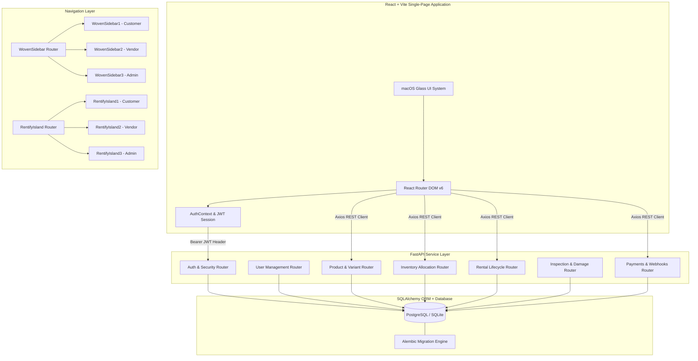
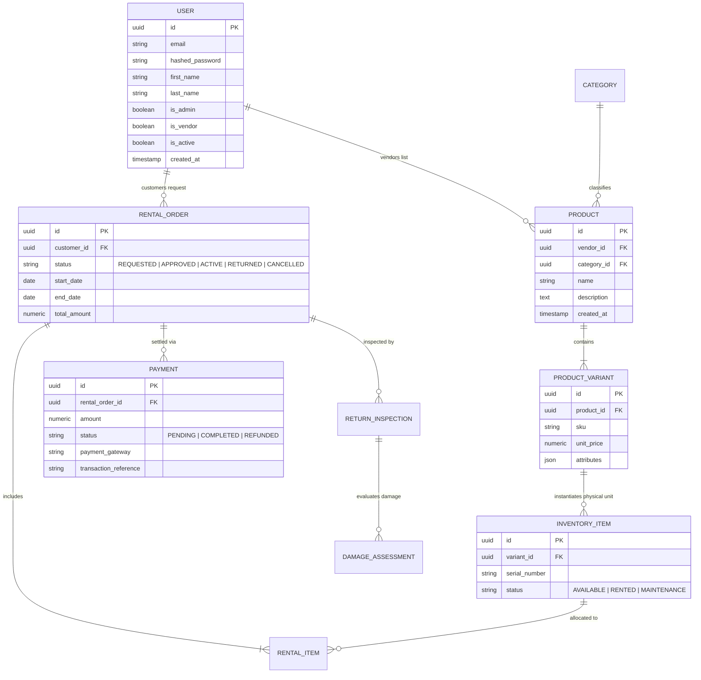

# 🚀 Rentify — Enterprise Multi-Tenant Rental Platform

**Rentify** is a production-grade, multi-tenant peer-to-peer and business-to-consumer (B2C/P2P) rental marketplace platform built with modern web technologies (**FastAPI**, **React 18**, **TypeScript**, **Tailwind CSS**, **SQLAlchemy**, and **Alembic**).

Featuring a **macOS/Loom-inspired glassmorphic design system**, Rentify delivers separate, role-tailored portals for **Customers**, **Vendors**, and **Platform Administrators**.

---

## 📑 Table of Contents
1. [System Architecture](#-system-architecture)
2. [Key Portals & Features](#-key-portals--features)
   - [Customer Portal](#1-customer-portal-app)
   - [Vendor Console](#2-vendor-console-vendor)
   - [Admin Superuser Console](#3-admin-superuser-console-admin)
3. [Design System & UI Components](#-design-system--ui-components)
4. [Backend API Specifications](#-backend-api-specifications)
5. [Database Schema & Domain Models](#-database-schema--domain-models)
6. [Security & Authentication](#-security--authentication)
7. [Installation & Setup Guide](#-installation--setup-guide)
8. [Build & Verification](#-build--verification)

---

## 🏗️ System Architecture

Rentify follows a decoupled, client-server architecture with a RESTful API backend and a reactive single-page frontend application.



---

## 🌟 Key Portals & Features

### 1. Customer Portal (`/app`)
Designed for renters seeking seamless product exploration, transparent rental pricing, checkout, and activity tracking.

- **Home & Discovery (`/app`)**: Dynamic product showcase featuring search bars, category quick filters, featured rental items, and promotional hero banners.
- **Explore & Filter (`/app/explore`)**: Comprehensive catalog view with animated macOS filter switches, price range sliders, sub-category tabs, and responsive grid displays.
- **Product Details (`/app/products/:id`)**: Rich product views displaying image galleries, specifications, product variant selectors (e.g. Size, Color, Capacity), unit prices (`₹/day`), and live rental cost calculation.
- **Rental Request Checkout (`/app/rentals/new`, `/app/products/:id/request`)**: Multi-step rental checkout flow allowing users to pick start/end dates, delivery addresses, and calculate totals.
- **My Rentals (`/app/rentals`)**: Order management hub listing active, pending, completed, and cancelled rental contracts with status indicators.
- **Activity Feed (`/app/activity`)**: Real-time activity timeline providing order updates, payment confirmations, and direct links to rental orders (`RN-XXXXXXXX`).
- **Profile & Settings (`/app/profile`)**: Account management interface for updating personal details, viewing user roles, and managing security settings.

---

### 2. Vendor Console (`/vendor`)
Designed for merchants and item owners to list rental inventory, track physical assets, and process customer fulfillment requests.

- **Vendor Dashboard (`/vendor`)**: Real-time analytics dashboard presenting key performance indicators:
  - **Products Count**: Total active listings managed by the vendor.
  - **Inventory Units**: Managed physical stock items across all variants.
  - **Rental Orders**: Active customer orders awaiting fulfillment or return.
  - **Total Revenue (`₹`)**: Cumulative gross rental earnings.
- **Product Catalog Management (`/vendor/products`)**: Interface to create, edit, and publish rental items, set daily rates, categorize products, and attach variant specifications.
- **Inventory Stock Control (`/vendor/inventory`)**: Physical asset manager tracking individual inventory items by serial number and operational status (`AVAILABLE`, `RENTED`, `MAINTENANCE`).
- **Rental Order Fulfillment (`/vendor/rentals`)**: Order management console for approving customer rental requests, assigning physical inventory units, and initiating returns.

---

### 3. Admin Superuser Console (`/admin`)
Designed for platform operators to oversee global platform metrics, manage user permissions, monitor payments, and audit inventory.

- **Admin Dashboard (`/admin`)**: High-level platform control metrics:
  - **User Base Audit**: Total registered user accounts.
  - **Global Catalog**: Total platform listings.
  - **Active Rentals**: Platform-wide active rental contracts.
  - **Gross Payments**: Platform transaction volume.
- **User Directory & Privileges (`/admin/users`)**: User management interface allowing superusers to view user details, toggle account activation, and escalate account permissions (`is_admin`, `is_vendor`).
- **Global Product Catalog (`/admin/products`)**: Platform-wide catalog audit tool to review and manage all listed items.
- **Global Rental Audit (`/admin/rentals`)**: Centralized rental contract registry with filtering by status and vendor.
- **Payment Gateway Logs (`/admin/payments`)**: Financial transaction logger tracking payment IDs, gateway response status, transaction amounts, and refund logs.
- **Global Inventory Audit (`/admin/inventory`)**: Stock control registry listing every physical inventory item across all vendors.

---

## 🎨 Design System & UI Components

Rentify features a custom-built **Loom macOS Glassmorphism Design System** crafted with Vanilla CSS and Tailwind CSS.

### **Core Visual Aesthetics**
- **Frosted Glass Containers**: Ultra-sleek glassmorphic sidebars and cards using `backdrop-blur-2xl`, subtle white borders (`border-white/60`), and ambient drop shadows.
- **Floating Dynamic Islands**: Top floating navigation bars (`RentifyIsland`) inspired by Apple's Dynamic Island, featuring smooth drop-down menus, search toggles, and user badges.
- **macOS Window Toolbars**: Signature macOS red/yellow/green control dots with status indicators (`VENDOR PORTAL ACTIVE // ONLINE`).
- **Interactive Loom Cards**: Elevated card components (`LoomCard`) with subtle hover elevation, micro-interactions, and custom HSL color tokens.

### **Role-Specific Component Hierarchy**

```
src/components/layout/
├── WovenSidebar.tsx       # Main router wrapper for Sidebars
├── WovenSidebar1.tsx      # Customer Navigation Sidebar
├── WovenSidebar2.tsx      # Vendor Navigation Sidebar (Loom Theme)
├── WovenSidebar3.tsx      # Admin Superuser Navigation Sidebar (Loom Theme)
├── RentifyIsland.tsx      # Main router wrapper for Header Islands
├── RentifyIsland1.tsx     # Customer Header Island
├── RentifyIsland2.tsx     # Vendor Header Island
└── RentifyIsland3.tsx     # Admin Header Island
```

---

## 🔌 Backend API Specifications

The backend is built with **FastAPI** following standard REST conventions.

### **1. Authentication & Security (`/auth`)**
| Method | Endpoint | Description | Access |
| :--- | :--- | :--- | :--- |
| `POST` | `/auth/token` | Authenticates user credentials and returns OAuth2 JWT access token | Public |
| `GET` | `/users/me` | Retrieves the currently authenticated user profile | Authenticated |
| `PUT` | `/users/role` | Dynamically updates user role flags (`is_vendor`, `is_admin`) | Authenticated |

### **2. Products & Variants (`/products`, `/product-variants`)**
| Method | Endpoint | Description | Access |
| :--- | :--- | :--- | :--- |
| `GET` | `/products/` | Lists all products with optional category/search filters | Public |
| `POST` | `/products/` | Creates a new product listing | Vendor / Admin |
| `GET` | `/products/{id}` | Fetches product details and associated variants | Public |
| `POST` | `/product-variants/` | Creates a product variant with attributes and unit prices | Vendor / Admin |
| `GET` | `/product-variants/{id}`| Retrieves variant specifications and unit price | Public |

### **3. Inventory Management (`/inventory`)**
| Method | Endpoint | Description | Access |
| :--- | :--- | :--- | :--- |
| `GET` | `/inventory/` | Lists physical inventory items | Vendor / Admin |
| `POST` | `/inventory/` | Registers a new physical inventory unit (serial number, status) | Vendor / Admin |
| `GET` | `/inventory/{id}` | Retrieves inventory unit detail and allocation history | Vendor / Admin |

### **4. Rental Orders & Lifecycle (`/rentals`, `/rentals/lifecycle`)**
| Method | Endpoint | Description | Access |
| :--- | :--- | :--- | :--- |
| `POST` | `/rentals/` | Submits a new rental contract request | Customer |
| `GET` | `/rentals/` | Lists user/vendor rental contracts | Authenticated |
| `GET` | `/rentals/{id}` | Fetches detailed rental order breakdown | Order Parties |
| `POST` | `/rentals/{id}/approve` | Approves a requested rental contract | Vendor / Admin |
| `POST` | `/rentals/{id}/start` | Activates rental contract upon item pickup/delivery | Vendor / Admin |
| `POST` | `/rentals/{id}/return` | Initiates rental return and inspection process | Vendor / Admin |

### **5. Inspections & Damage Assessments (`/return-inspections`, `/damage-assessments`)**
| Method | Endpoint | Description | Access |
| :--- | :--- | :--- | :--- |
| `POST` | `/return-inspections/` | Records item inspection upon return | Vendor / Admin |
| `POST` | `/damage-assessments/` | Assesses damage penalties and fee additions | Vendor / Admin |

### **6. Payments & Webhooks (`/payments`, `/payment-webhooks`)**
| Method | Endpoint | Description | Access |
| :--- | :--- | :--- | :--- |
| `POST` | `/payments/` | Initiates payment transaction for rental order | Customer |
| `GET` | `/payments/` | Audits platform transaction history | Admin |
| `POST` | `/payment-webhooks/` | Handles asynchronous payment gateway callback events | Public / Webhook |

---

## 🗄️ Database Schema & Domain Models

Rentify uses **SQLAlchemy ORM** mapped to PostgreSQL / SQLite tables via **Alembic** migrations.



---

## 🔒 Security & Authentication

- **JWT Tokens**: Signed JSON Web Tokens containing user sub and expiration claims (`exp`).
- **Role-Based Authorization (`RoleRoute`)**: Route guards enforcing strict role checks (`allowedRoles={["admin"]}`, `allowedRoles={["vendor"]}`).
- **Password Security**: Password hashing via `bcrypt` / `passlib` with salt rounds.
- **Context Protection**: React `AuthContext` provides central token state, local storage persistence, and dynamic role evaluation.

---

## ⚡ Installation & Setup Guide

### Prerequisites
- **Node.js** v18.0.0+
- **Python** v3.10+
- **Git**

---

### 1. Backend Setup

```bash
# Navigate to backend directory
cd backend

# Create Python virtual environment
python -m venv venv

# Activate virtual environment
# Windows (PowerShell):
.\venv\Scripts\Activate.ps1
# macOS / Linux:
source venv/bin/activate

# Install backend dependencies
pip install -r requirements.txt

# Run database migrations with Alembic
alembic upgrade head

# Start FastAPI application server
uvicorn app.main:app --reload --port 8000
```
> The API server will be available at `http://localhost:8000`.  
> Interactive Swagger API docs are available at `http://localhost:8000/docs`.

---

### 2. Frontend Setup

```bash
# Navigate to frontend directory
cd frontend

# Install dependencies
npm install

# Start Vite development server
npm run dev
```
> The frontend application will be available at `http://localhost:5173`.

---

## 🧪 Build & Verification

To verify typescript compilation and build the production bundle:

```bash
cd frontend
npm run build
```

---

## 📄 License

This project is licensed under the **MIT License**.
